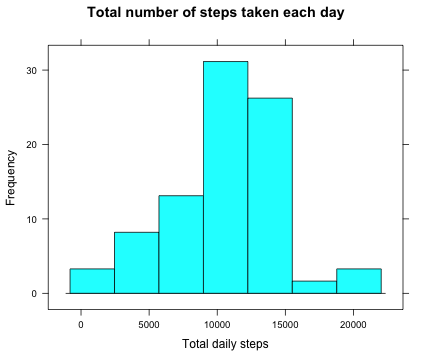
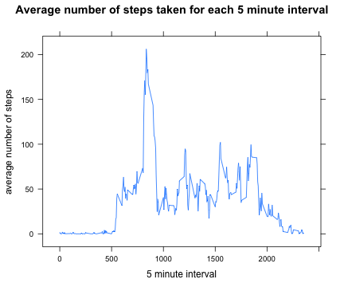
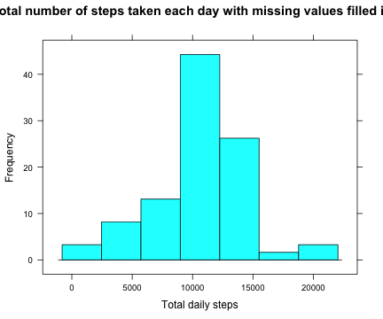
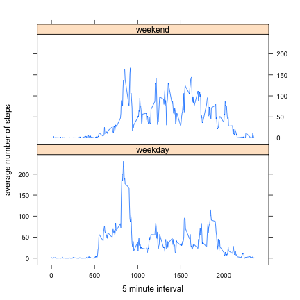

Activity Monitoring
========================================================

The data from a personal activity monitoring device is collected at 5 minute intervals through the day. The data consists of two months of data from an anonymous individual collected during the months of October and November, 2012, and include the number of steps taken in 5 minute intervals each day.

The data is stored in the file 'activity.csv', and includes the variables:
* **steps**: Number of steps taken in a 5-minute interval (missing values are coded as NA)
* **date**: Date on which the measurement was taken in YYYY-MM-DD format
* **interval**: Identifier for the 5 minute interval in which measurement was taken

### Loading and preprocessing the data

The data is read in to the dataframe activity as


```r
activity = read.csv('activity.csv')
```

The structure of the data shows that the dataset contains 17,568 observations.


```r
str(activity)
```

```
## 'data.frame':	17568 obs. of  3 variables:
##  $ steps   : int  NA NA NA NA NA NA NA NA NA NA ...
##  $ date    : Factor w/ 61 levels "2012-10-01","2012-10-02",..: 1 1 1 1 1 1 1 1 1 1 ...
##  $ interval: int  0 5 10 15 20 25 30 35 40 45 ...
```

The date column, which is a factor variaable, is converted to the date class using the as.Date() function.


```r
activity$date = as.Date(activity$date, format = '%Y-%m-%d')
```

### The mean total number of steps taken per day

A new dataframe daily activity, containing the total number of steps taken each day is created using the plyr package.


```r
library(plyr)
daily_activity = ddply(activity, 'date', summarize, total.steps = sum(steps))
head(daily_activity)
```

```
##         date total.steps
## 1 2012-10-01          NA
## 2 2012-10-02         126
## 3 2012-10-03       11352
## 4 2012-10-04       12116
## 5 2012-10-05       13294
## 6 2012-10-06       15420
```

A histogram of the total number of steps taken each day shows the following distribution.


```r
library(lattice)
histogram(~daily_activity$total.steps, 
          main = 'Total number of steps taken each day', 
          xlab = 'Total daily steps', ylab = 'Frequency')
```

 

Ignoring the missing values, the mean and median total number of steps taken per day are 


```r
mean(daily_activity$total.steps, na.rm = TRUE)
```

```
## [1] 10766
```

and 


```r
median(daily_activity$total.steps, na.rm = TRUE)
```

```
## [1] 10765
```

respectively.

### The average daily activity pattern

A dataframe average_activity, containing the average number of steps taken, averaged across all days, for each 5 minute interval can be created, again using the plyr package. The missing values are ignored.


```r
average_activity = ddply(activity, 'interval', summarize, 
                         average.steps = mean(steps, na.rm = TRUE))
```

A time series plot shows the the average number of steps taken for each 5 minute interval


```r
xyplot(average_activity$average.steps ~ average_activity$interval, type = 'l',
       main = 'Average number of steps taken for each 5 minute interval',
       xlab = '5 minute interval', ylab = 'average number of steps')
```

 

On average across all the days in the dataset, the 5 minute interval that contains the maximum number of steps is


```r
average_activity$interval[which(average_activity$average.steps == max(average_activity$average.steps))]
```

```
## [1] 835
```

and it contains 


```r
max(average_activity$average.steps)
```

```
## [1] 206.2
```

number of steps.

### Inputing missing values

There are a number of days/intervals where there are missing values denoted as NA. These missing values may introduce bias into some calculations or summaries of the data.

The total number of missing values in the dataset are


```r
length(which(is.na(activity$steps)))
```

```
## [1] 2304
```

The missing values can be filled in with the mean number of steps for that 5 minute interval. First, a new dataframe activity_f is created with a variable ave.steps that contains the average number of steps for each 5 minute interval.


```r
activity_f = ddply(activity, 'interval', transform, ave.steps = mean(steps, na.rm = TRUE))
```

The missing values in the steps column is then replaced with the value of the ave.steps column, the ave.steps column is removed, and the new dataframe is reordered according to the date as in the original activity dataframe.


```r
missing = which(is.na(activity_f$steps))
activity_f$steps[missing] = activity_f$ave.steps[missing]
activity_f = activity_f[1:dim(activity_f)[2]-1]
activity_f = ddply(activity_f, 'date')
str(activity_f)
```

```
## 'data.frame':	17568 obs. of  3 variables:
##  $ steps   : num  1.717 0.3396 0.1321 0.1509 0.0755 ...
##  $ date    : Date, format: "2012-10-01" "2012-10-01" ...
##  $ interval: int  0 5 10 15 20 25 30 35 40 45 ...
```

```r
head(activity_f)
```

```
##     steps       date interval
## 1 1.71698 2012-10-01        0
## 2 0.33962 2012-10-01        5
## 3 0.13208 2012-10-01       10
## 4 0.15094 2012-10-01       15
## 5 0.07547 2012-10-01       20
## 6 2.09434 2012-10-01       25
```

The total number of steps taken each day now has the distribution shown in the figure.


```r
daily_activity_f = ddply(activity_f, 'date', summarize, total.steps = sum(steps))
```


```r
histogram(~ daily_activity_f$total.steps,
          main = 'Total number of steps taken each day with missing values filled in', 
          xlab = 'Total daily steps', ylab = 'Frequency')
```

 
 
The mean and median total number of steps taken per day are 


```r
mean(daily_activity_f$total.steps)
```

```
## [1] 10766
```

and 


```r
median(daily_activity_f$total.steps)
```

```
## [1] 10766
```

respectively.

Note that the mean and median total number of steps taken per day is virtually identical to those when the missing values were simply ignored. This is since the missing values were filled in with the average values over the dataset. Imputing missing data with the mean values over the dataset does not affect the mean.

### Difference in activity pattern bewteen weekdays and weekends

In order to compare the activity pattern between weekdays and weekends, a new factor variable is created in the dataset with two levels - 'weekday' and 'weekend' - indicating whether a given date is a weekday or weekend day.


```r
activity_f$day <- factor(weekdays(activity_f$date) %in% c('Saturday', 'Sunday'), 
                         labels = c('weekday', 'weekend'))
head(activity_f)
```

```
##     steps       date interval     day
## 1 1.71698 2012-10-01        0 weekday
## 2 0.33962 2012-10-01        5 weekday
## 3 0.13208 2012-10-01       10 weekday
## 4 0.15094 2012-10-01       15 weekday
## 5 0.07547 2012-10-01       20 weekday
## 6 2.09434 2012-10-01       25 weekday
```

A dataframe, average_activity_f, containing the average number of steps taken for each 5 minute interval across all weekdays or weekend days is created using the ddply() function. The dataset with the filled-in missing values are used.


```r
average_activity_f = ddply(activity_f, c('interval', 'day'), summarize, 
                           average.steps = mean(steps, na.rm = TRUE))
head(average_activity_f)
```

```
##   interval     day average.steps
## 1        0 weekday       2.25115
## 2        0 weekend       0.21462
## 3        5 weekday       0.44528
## 4        5 weekend       0.04245
## 5       10 weekday       0.17317
## 6       10 weekend       0.01651
```

A time series plot shows the the average number of steps taken for each 5 minute interval for weekdays and weekend days, showing that the distribution of activity is more even on weekend days than on weekdays.


```r
xyplot(average_activity_f$average.steps ~ average_activity_f$interval | average_activity_f$day, 
       xlab = '5 minute interval', ylab = 'average number of steps', type = 'l',
       layout = c(1, 2))
```

 
